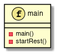
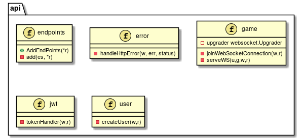
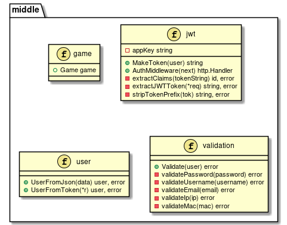
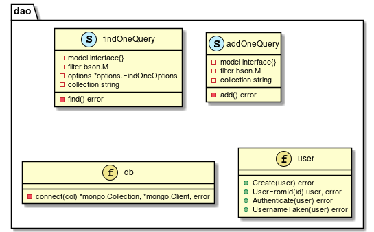
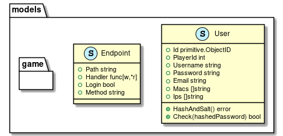
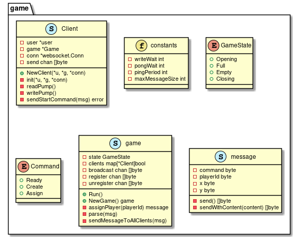
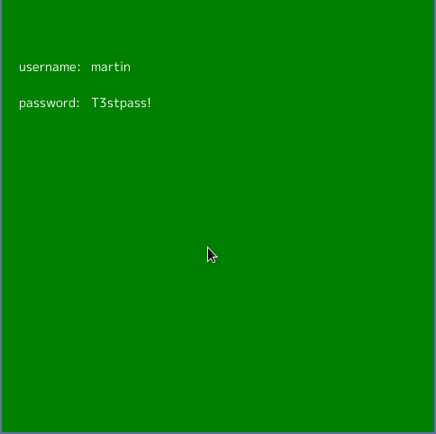
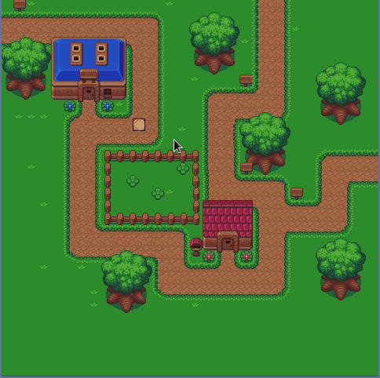

[](https://codecov.io/gh/DAT4/backend-project)

# Implementation
In this section we will go through each of the packages implemented in
the system. Each package is illustrated with a UML diagram and then one
or two functions/methods from the package will be revealed and briefly
explained.

## The packages in the backend logic

The central logic of the system is implemented in Go, and go is a
structured language, so the UML syntax which is used in the following
images is not following all the standard UML rules.

In go public functions are written with capital first letter and private
are with lower case first letter. private means that they can be reached
from within the package they live in. And there are no classes. So in
some cases the packages on the map is just representing a file, in other
they are representing a struct. The files are marked with a (f) and the
structs are marked wiht an (s)

### The main package

The main package has only one file which is the main.go file and it has
two functions.



In the main function two threads will start up. One which is listening
for HTTP connections, and another which is listening for websocket
clients wanting to connect.

```go
func main() {
    go middle.Game.Run()
    startREST()
}
```

When setting up the REST service, a router is used to make the handlding
of endpoints simpler, then the endpoints will be added and the cors
headers will be added.

```go
func startREST() {
    r := mux.NewRouter()
    api.AddEndpoints(r)
    handler := cors.Default().Handler(r)
    fmt.Println("Running on port 8056")
    log.Fatal(http.ListenAndServe(":8056", handler))
}
```

### The api package

This package holds the configuration of the endpoints and the handler
functions which is being called when a user connects to a endpoint.



The endpoints function has a list of endpoints and takes a pointer to a
mux.Router which it will assign each endpoint to as a side effect.

```go
func addendpoints(r *mux.router) {
    endpoints := []models.endpoint{
        {
            path:    "/login",
            handler: tokenhandler,
            method:  "post",
        },
        {
            path:    "/register",
            handler: createuser,
            method:  "post",
        },
        {
            path:    "/join",
            handler: joinwebsocketconnection,
            login:   true,
            method:  "get",
        },
    }
    for _, e := range endpoints {
        middle.add(e,r)
    }
}
```

If an enpoint is marked with login = true, then the Add method is gonna
wrap the handler function with a JWT Handler function which requires the
user to pass a token in the HTTP header.

### The middle package

This package contains functions which is not directly coupled to the
presentation layer or the data layer. This is for instance the
validation package which is used when a user is created.



Validation and conversion of users are done in this package as well as
the logic for JWT.

```go
func MakeToken(u models.User) (string, error) {
    token := jwt.NewWithClaims(jwt.SigningMethodHS256, jwt.MapClaims{
        "user": u.Id,
        "exp":  time.Now().Add(time.Hour * time.Duration(1)).Unix(),
        "iat":  time.Now().Unix(),
    })
    return token.SignedString([]byte(appKey))
}
```

A token is created with a user id injected into it, and the token will
live for 1 hour. The token is hashed with the appKey

### the dao package

This package has the functions which can comunicate with the mongo
database.



The functions are divided into two layers. One for the concrete which
containing as little database specific code as possible.

```go
func Create(user *user.User) (err error) {
    q2 := AddOneQuery{
        Model:      &user,
        Filter:     nil,
        Collection: "users",
    }
    return q2.Add()
}
```

And another more abstract which can be used by the concrete.

```go
func (query *AddOneQuery) Add() error {
    col, cli, err := connect(query.Collection)
    defer cli.Disconnect(context.Background())
    if err != nil {
        return err
    }
    _, err = col.InsertOne(context.Background(), query.Model)
    return err
}
```

### The models package

Here the Endpoint, User and the game models live. The game has alot of
stuff inside it so that one gets its own package which will be explaned
later.



In Go the models are defined similar to the stucts in C, except the name
is before the type, and it is possible to do alot of smart things.

The user struct is a DTO which is used in both the database and in the
frontend. In go it is possible to Encode/Decode a struct to/from eg.
JSON format very easily, and with the strings added in the struct
stating json and bson, it gives the possibility to decide how the json
or bson should look like

```go
type User struct {
    Id       primitive.ObjectID `json:"-" bson:"_id,omitempty"`
    PlayerID int                `json:"-"`
    Username Username           `json:"username"`
    Password Password           `json:"password"`
    Email    Email              `json:"email"`
    Macs     []Mac              `json:"-"`
    Ips      []Ip               `json:"-"`
}
```

In the user struct above some of the json has a 'dash' as a name, this
means that this attribute is left out on the json side. And on the bson
in the Id the name is changed to \_id because that is how the
autogenerated id in mongodb has its name

then we can decode json like this

```go
...
var user User
var data = request.Body
err = json.NewDecoder(data).Decode(&user)
...
```

There exist a similar function for the MongoDB bson type which is also
used in the dao package

### The game package

This is the most central package of the whole system and contains all
the logic that has to do with the websocket



Game is build as a pipelining hub with 3 channels and a map of currently
registered clients.

```go 
func NewGame() *Game {
    return &Game{
        clients:    make(map[*Client]bool),
        broadcast:  make(chan []byte),
        register:   make(chan *Client),
        unregister: make(chan *Client),
    }
}
```

The game struct is a critical point in the game bacause many corountines
will want to access the game at the same time, It is placed as a global
variable in the middle package, and accessed every time a new client
subscribes. The client will then create 2 coroutines which will
communicate with the games channels each time he sends a message.\
These 3 channels are explained on the next page where we will look at
the games Run method which is running thorough the whole process of the
application

This method is the very first method which is executed in a goroutine
just before the http server is started.

```go 
func (g *Game) Run() {
    for {
        select {
        case client := <-g.register:
            fmt.Println("Trying to connect new player")
            err := client.sendStartCommand(assignPlayer(client.user.PlayerID))
            if err != nil {
                fmt.Println("error with json closing ws:", err)
                close(client.send)
                return
            }
            g.clients[client] = true
            fmt.Println("Player successfully connected")
        case client := <-g.unregister:
            if _, ok := g.clients[client]; ok {
                delete(g.clients, client)
                close(client.send)
            }
        case message := <-g.broadcast:
            g.parse(message)
        }
    }
}
```

This method is running forever. The select statement is like a switch
statement, except this one is listening for events in channels.

When something is sent to one of the channels, the corresponding case
will be executed.

-   **register:** When a client is first created he will send a pointer
    of himself to this channel.

-   **unregister:** If a client losses connection timeouts then he will
    send a pointer of himself to this channel and he will be deleted
    from the map

-   **broadcast:** This channel is used to send information between
    clients. When a client sends a message it will be broadcasted

## Frontends

We have created a website which connects to the backend via REST and a
game which connects to the backend via REST and websocket but we will
not talk about the implementation of those in this report, instead you
will get some pictures.

### Log in to the game

When you first open the game you will need to login, the text is written
on the screen.



### Play the game

When you are logged in you will have a dot with an arrow on the screen
which you will be able to move around with


